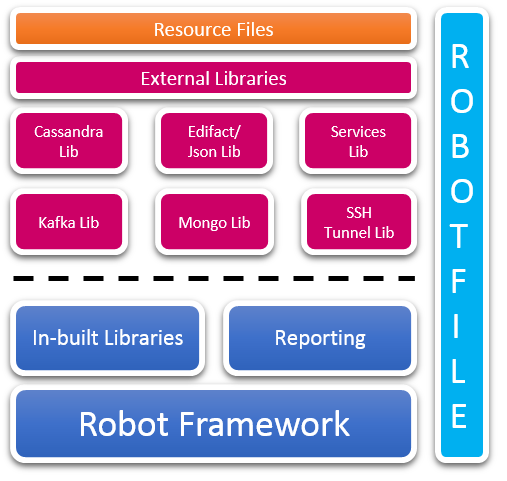

Robot Framework Libraries
===================================
This module contains various libraries to help ease 
testing using robot framework. The libraries are written in python.

Architecture
--------------



Short Description
-----------------

`Robot Framework`  libraries for following:
1. Cassandra
2. MongoDB
3. Kafka
4. Json
5. Edifact
6. Tunnel
7. WebService
8. Subset in output
9. Random Generators 

Installation
------------
``` 
pip install -r requirements.txt
#or
python -m pip install -r requirements.txt
``` 

Running Robot framework
----------

```
python -m robot web_service_test
```

Configurations
------

Configurations(Constants) are in variable library in [config.py](src/config.py)

 
    
Sample Robot Tests
-------
All the sample robot test scripts are present in [here](test/sample_wbs_test).
    
Webservice Testing
-------------

For details on [webservice testing](doc/webservice_testing.md)    